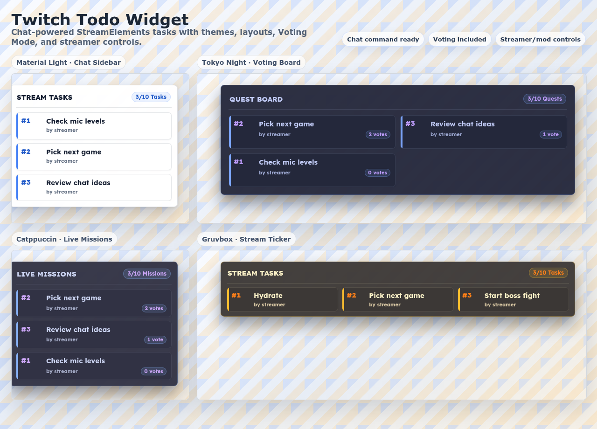

# Twitch Todo Widget

A StreamElements custom widget for Twitch streamers. Viewers can add tasks from chat, Task Owners can complete or remove their own tasks, and Task Managers can manage the list with override commands.

Built for live streams that need a lightweight task, quest, mission, or challenge overlay driven by Twitch chat. The widget is copy-paste friendly for StreamElements and includes local preview, streamer dashboard controls, Hosted Overlay MVP primitives, and smoke tests for safer setup.



## Implemented Features

- Chat-driven Task List with configurable add, complete, remove, reset, and vote commands.
- Stable Task Numbers for `!done`, `!delete`, and `!vote`, even when visual sort changes.
- Title display can use fixed text or a digital clock.
- Task Owner and Task Manager permissions for predictable moderation.
- Optional Voting Mode with cooldowns, duplicate vote handling, vote counts, and priority sort.
- Theme Presets: Material light, Material dark, Catppuccin, Gruvbox, Nord, Tokyo Night, Dracula, Rose Pine, Kanagawa, One Dark, and Monokai.
- Layout Modes: compact sidebar, horizontal ticker, and large board.
- Auto-scrolling task list with configurable max height and optional hidden scrollbar, so full lists do not stretch the overlay.
- Quest/Mission/Challenge wording controls without changing the underlying Task model.
- Custom panel, frame, and task icon images with opacity and fit controls.
- Animation controls for new and completed tasks, with reduced-motion support.
- StreamElements storage persistence with localStorage fallback for local preview.
- Local streamer dashboard controls in `preview.html` for adding, editing, completing, removing, and resetting tasks through Task List State.
- Hosted Overlay MVP render path in `hosted-overlay.html` that reads one complete Overlay State and stays read-only.
- Hosted Chat Command Handler boundary for future platform use, separate from Hosted Overlay rendering.

## Known Limitations

- Twitch Channel Points integration is not implemented.
- StreamElements Install remains copy-paste based. The hosted web platform, account system, database, and production dashboard routes are not included in this static widget repo.
- The widget does not send chat replies. Successes and Ignored Commands are silent by design.
- Task Text Editing exists in local streamer dashboard controls and hosted-platform primitives, but not as a StreamElements chat command.
- Hosted Overlay MVP renders saved Overlay State at initialization time. Polling, realtime refresh, and regenerated Overlay Link lifecycle are planned future platform work.
- Screenshot/demo media should be reviewed by a human before marketplace-style publishing.

## Planned Future Ideas

- Channel Points triggers.
- Optional approval queue before Tasks become Active Tasks.
- More theme packs and marketplace-ready image presets.
- Deeper visual regression coverage.
- Production hosted dashboard routes, backend persistence, auth, and Overlay Link lifecycle management.
- Realtime Hosted Overlay refresh after dashboard or chat command updates.

## Files

- `widget.html` goes in the StreamElements HTML tab.
- `widget.css` goes in the CSS tab.
- `widget.js` goes in the JS tab.
- `widget.json` goes in the Fields tab.
- `preview.html` is only for local testing.
- `hosted-overlay.html` is the static Hosted Overlay MVP shell for platform development, not a StreamElements tab.

## Local Preview

Run a local server from this folder:

```sh
python3 -m http.server 8000
```

Open:

```text
http://localhost:8000/preview.html
```

The preview includes a mock username, role selector, command input, streamer dashboard controls, quick action buttons, and debug log.
It also includes controls for Theme Presets, Quest Mode wording, Layout Modes, animations, panel images, frame images, and task icons.
The Platform snapshot panel shows the read-only Overlay State produced from the current fields and persisted task state.
Use it to inspect the future hosted-platform contract without changing StreamElements behavior.

## Smoke Test

Run the lightweight smoke suite from this folder:

```sh
bash scripts/smoke-test.sh
```

The command validates `widget.json`, starts a temporary local preview server, and runs browser smoke checks for theme wording, animations, layout modes, custom images, chat payloads, Platform snapshot contract, Hosted Overlay route, hosted Chat Command Handler boundary, and local preview controls. Browser checks require Chromium or Google Chrome on your machine; if neither is available, the command still validates the widget field JSON and skips browser checks.

## Default Commands

- `!task <text>` adds a task.
- `!done <id>` completes a task.
- `!delete <id>` removes a task.
- `!taskreset` clears all tasks and resets numbering to `#1`.
- `!vote <id>` votes for an active task when Voting Mode is enabled.

All command names are configurable in StreamElements fields and are matched case-insensitively.

## Permissions

- All viewers can add tasks.
- Task Owners can complete or remove their own tasks.
- Task Managers can complete or remove any task.
- Only Task Managers can reset the whole list.

Task Managers are the streamer and moderators by default. The widget detects moderator/streamer roles from chat event badges when available. You can also set fallback moderator usernames and a fallback streamer username in the fields.

## Task Capacity And Moderation

- Default Task Capacity: `10` active tasks, configurable from `1` to `20`.
- Default max task length: `80` characters.
- Default Task Owner Capacity: `2` active tasks.
- Default global add cooldown: `5` seconds.
- Default per-user add cooldown: `30` seconds.
- Links are rejected.
- Mentions and emoji are allowed.
- Blacklisted words can be configured as a comma-separated list.

Invalid commands are ignored silently in production. Enable `debugMode` while testing if you need console logs.

## Voting Mode

Voting Mode is optional and disabled by default. When enabled, Viewers can vote for Active Tasks with the configured vote command, defaulting to `!vote <Task Number>`.

- Vote commands are Ignored Commands while Voting Mode is disabled.
- Each Viewer has one active vote across the Task List.
- Duplicate vote behavior can either ignore later votes or move the Viewer vote to a new Active Task.
- Vote cooldown limits how quickly the same Viewer can cast or change a vote.
- Optional priority sort can move higher-voted Active Tasks earlier visually.
- Task Numbers remain stable even when vote priority sort changes the visual order. Use the visible number, such as `#7`, with `!done 7`, `!delete 7`, and `!vote 7`.
- Task Managers can still complete, remove, and reset Tasks regardless of vote counts.

## Display

- Compact vertical list with configurable corner position.
- Configurable title text or digital clock, empty state, Theme Preset, Quest Mode wording, Google Font, accent color, width, list height, opacity, custom panel image, and animations.
- Theme Presets include Material light, Material dark, Catppuccin, Gruvbox, Nord, Tokyo Night, Dracula, Rose Pine, Kanagawa, One Dark, and Monokai.
- Quest Mode wording can present the same Task List as Tasks, Quests, Missions, or Challenges without changing Task Numbers or Chat Commands.
- Layout Modes include compact sidebar for gameplay corners, horizontal ticker for top or bottom bars, and large board for chatting or intermission scenes.
- Full compact and board lists stay inside the configured max list height, can hide the scrollbar, and auto-scroll when content overflows.
- Voting Mode can show vote counts beside Task Owners and optionally sort Active Tasks by vote count.
- Optional panel background image, frame overlay image, and task icon image support StreamElements uploads.
- Panel and frame images include opacity controls and cover/contain fit modes. Task icons include an opacity control and render at a stable task-row size.
- Animation controls can be enabled or disabled and tuned with an animation speed slider. New tasks animate in, Completed Tasks get a brief completion pulse, and Removed Tasks leave quietly.
- Completed tasks stay visible briefly, then auto-hide. The default is `5` seconds.

Animations are visual only. Successful commands and Ignored Commands still use Silent Command Handling and never send chat replies.

## Custom Image Guidance

- Leave image fields empty to use the default polished Task Overlay.
- Use the panel background image for low-contrast texture, pattern, or branded scenery. Keep opacity around `0.15` to `0.35` for readable Task Text.
- Use the frame overlay image for transparent PNG borders, corners, or stream-package frames. Keep important artwork near the edges so it does not cover Task Text.
- Use the task icon image for a small brand mark, badge, gem, or checklist symbol beside each task.
- Prefer transparent PNG/WebP assets for frame and icon images. A `16:9` or `4:3` panel texture usually works well with cover fit, while a full-frame border usually works better with contain fit.

## Example Configurations

### Clean Gameplay Sidebar

- Theme Preset: `Material light`
- Layout Mode: `Compact sidebar`
- Position: `Top right`
- Voting Mode: `Disabled`
- Background opacity: `0.90` to `1.00`
- Animations: `Enabled`, speed near `1`

Use this for gameplay scenes where the Task Overlay should stay readable without taking over the screen.

### Dark Gameplay Sidebar

- Theme Preset: `Material dark`, `Tokyo Night`, or `One Dark`
- Font: `Lexend`
- Accent color: keep the preset default, or use a bright brand color with similar contrast
- Background opacity: `0.94` to `1.00`
- Panel image opacity: `0.00` to `0.18` if a branded texture is used

Use this when the overlay sits on bright gameplay and needs strong contrast without becoming neon or glassy.

### Editor Palette Overlay

- Theme Preset: `Catppuccin`, `Gruvbox`, `Nord`, `Dracula`, `Rose Pine`, `Kanagawa`, or `Monokai`
- Layout Mode: `Large board`
- Wording: Quests or Missions
- Voting Mode: `Enabled`
- Duplicate vote behavior: `Move vote to new task`
- Vote priority sort: `On`

Use this for intermission, chatting, challenge streams, or community-driven segments where viewer priority matters.

## StreamElements Setup

For a beginner-friendly walkthrough, see [Twitch Todo Widget Setup Guide](docs/SETUP.md).

1. Create a custom widget in your StreamElements overlay.
2. Paste each `widget.*` file into the matching editor tab.
3. Paste `widget.json` into the Fields tab.
4. Configure Fields: theme, layout, wording, commands, limits, voting, and image settings.
5. Add fallback streamer and moderator names if badge detection is not available in your test environment.
6. Test with local preview first, then test inside StreamElements while `debugMode` is enabled.
7. Turn `debugMode` off for production.

## Hosted Platform MVP Notes

This repo now contains static primitives for the future Widget Platform, while the production hosted platform itself remains future work.

- Overlay State is the public-read contract for a Streamer Profile.
- `hosted-overlay.html` renders one complete saved Overlay State and only shows Active Widgets.
- Inactive Overlay Links render an empty transparent shell and must not expose Overlay State or streamer-specific data.
- Hosted Overlay is read-only. Dashboard writes and Chat Command Handler writes happen outside the public render route.
- `window.TwitchTodoWidget.dashboard` provides the first local dashboard write path for Task List State.
- `window.TwitchTodoWidget.createHostedChatCommandHandler()` provides the hosted chat command boundary for future backend/platform wiring.
- `widgets[].data.todos` is render input, not the write model. Dashboard/chat writes should update Task List State first, then derive Overlay State.

## StreamElements Troubleshooting

- Copy all required tabs after updates: `widget.html`, `widget.css`, `widget.js`, and `widget.json`. Position fixes live in CSS, command fixes live in JS, and debug controls live in Fields.
- Enable **Show debug overlay** while testing live chat commands. The overlay reports whether the widget is loaded, which event arrived, and whether a command was queued, accepted, ignored, unknown, or failed.
- Use **Diagnostic button** in the Moderation field group to confirm the widget can add a task without relying on live chat.
- If the debug overlay shows a sandboxed `localStorage` error in StreamElements preview, the widget falls back to memory storage so commands can still display. In live overlay or OBS, `SE_API.store` should provide persistent state.
- If `!task` is ignored with a cooldown or capacity reason, reduce `globalCooldownSeconds`, `userCooldownSeconds`, `perUserTaskLimit`, or `maxTasks` while testing.
- If bottom positions still look wrong after changing Appearance fields, refresh the overlay or browser source and confirm the latest `widget.css` was copied.

## Debug Mode

Enable `debugMode` only while testing. It logs Ignored Commands, configuration, and command parsing details in the browser console or local preview log. Keep it disabled during normal streams to avoid noisy console output.
